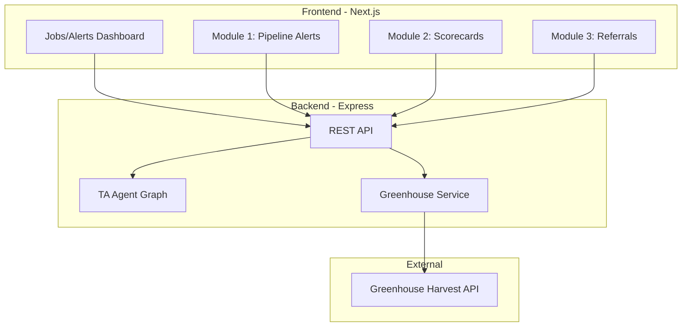

# TA Agent Skeleton - Talent Acquisition Agent

## Architecture Overview

Clone ai-coding-tutor structure into ta-agent and adapt for TA Ops. Replace the coding-tutor domain (problems, submissions, feedback) with TA domain (jobs, candidates, applications, alerts).

---

## Selected Use Cases (5 total, covering Modules 1–3)

| # | Module | Use Case | Description |
|---|--------|----------|-------------|
| 1 | M1 | **Stage SLA Alerts** | Flag candidates in any stage longer than configurable SLA (Application Review 3d, Recruiter Screen 5d, etc.) |
| 2 | M1 | **Stale Jobs** | Jobs with zero candidate activity in 10+ business days |
| 3 | M1 | **Offers No Response** | Offers extended 3+ business days with no candidate response |
| 4 | M2 | **Scorecard Accountability** | Flag interviewers who haven't submitted scorecards within 24h of interview (24–48h → recruiter, 48h+ → TA leader) |
| 5 | M3 | **Referral Follow-up** | Flag referral candidates not reviewed or with no next action scheduled |

---

## Tech Stack

- **Backend**: Express, TypeScript, LangGraph, Drizzle ORM, PostgreSQL (optional)
- **Frontend**: Next.js 14 App Router, Tailwind, Zustand
- **Integrations**: Greenhouse Harvest API v1 (Basic Auth)

---

## Implementation Plan

### Phase 1: Project Scaffold

1. Copy structure from ai-coding-tutor to ta-agent
2. Rename and strip coding-tutor specifics
3. Add TA domain types and schema

### Phase 2: Greenhouse Integration

1. **Greenhouse service** (`backend/src/services/greenhouse.service.ts`):
   - Base URL: `https://harvest.greenhouse.io/v1`
   - Auth: Basic Auth with `api_key:` (Base64 encoded)
   - Methods: `getJobs()`, `getApplications(jobId?)`, `getCandidates()`, `getScorecards()`, `getJobStages(jobId)`
   - Handle pagination (`per_page`, `page`)

2. **SLA configuration** (`backend/src/config/sla.config.ts`):
   - Default stage SLAs (Application Review: 3, Recruiter Screen: 5, etc.)
   - Configurable via env or JSON config

### Phase 3: Database Schema (Optional)

- `jobs` – synced from Greenhouse
- `applications` – candidate applications
- `alerts` – generated alerts
- `sla_config` – configurable stage SLAs

**Note**: Database is optional. Alerts can run in-memory; jobs fetch live from Greenhouse.

### Phase 4: Agent System

1. **TA Agent graph** (`backend/src/agents/ta-agent.graph.ts`):
   - Nodes: `fetch_greenhouse_data` → `generate_alerts` → `format_response`
   - State: `AgentState` with jobs, applications, alerts

2. **Alert generators**:
   - `stalled-pipeline.agent.ts` – Stage SLA, Stale Jobs, Offers No Response
   - `scorecard.agent.ts` – Missing scorecards with escalation tier
   - `referral.agent.ts` – Unreviewed referrals, no next action

### Phase 5: API Routes

- `GET /api/jobs` – List jobs from Greenhouse
- `GET /api/alerts` – Get alerts by type (stalled, scorecard, referral)
- `POST /api/alerts/refresh` – Trigger agent run to refresh alerts
- `GET /api/greenhouse/sync` – Sync to DB (requires DATABASE_URL)
- `GET /api/greenhouse/test` – Test Greenhouse connection
- `GET /api/health` – Health check

### Phase 6: Frontend

- `/` – Overview with alert counts by module
- `/alerts/stalled` – Module 1: Stalled pipeline
- `/alerts/scorecards` – Module 2: Missing scorecards
- `/alerts/referrals` – Module 3: Referral follow-up
- `/settings` – Greenhouse API key, LLM settings

### Phase 7: Business Logic Helpers

- `businessDaysBetween(from, to)` – Exclude weekends
- Stage name → SLA mapping (configurable)
- Referral source detection (`credited_to` / `referrer_id`)

---

## Key Files

| File | Purpose |
|------|---------|
| `backend/src/services/greenhouse.service.ts` | Greenhouse API v1 client |
| `backend/src/config/sla.config.ts` | Stage SLA defaults |
| `backend/src/agents/ta-agent.graph.ts` | Main agent orchestration |
| `backend/src/agents/stalled-pipeline.agent.ts` | Module 1 logic |
| `backend/src/agents/scorecard.agent.ts` | Module 2 logic |
| `backend/src/agents/referral.agent.ts` | Module 3 logic |
| `backend/src/routes/alerts.routes.ts` | Alert API |
| `backend/src/routes/jobs.routes.ts` | Jobs API |
| `frontend/src/app/page.tsx` | Dashboard home |
| `frontend/src/app/alerts/[type]/page.tsx` | Alert list pages |

---

## Greenhouse API (v1)

- Base: `https://harvest.greenhouse.io/v1`
- Auth: `Authorization: Basic <base64(api_key:)>`
- Endpoints: `GET /jobs`, `GET /applications`, `GET /candidates/{id}`, `GET /jobs/{id}/stages`

---

## Security

Do not commit the Greenhouse API key. Use `.env` or add via Settings UI. Keys can be stored in-memory (lost on restart) or in `.env` for persistence.
